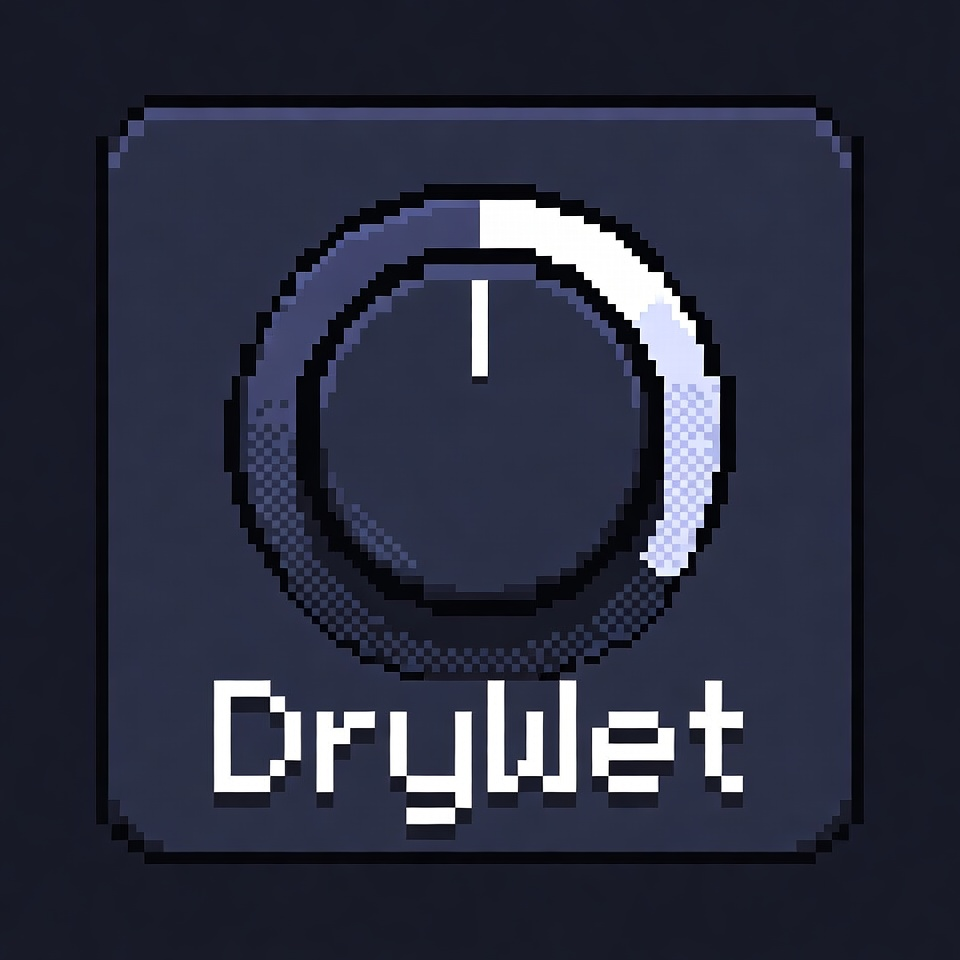

# drywet



A musician-facing runtime for desktop audio apps: one Transport, Tone-style time strings, Sampler / Synth / Drum, Sequence / Part / Loop, and live notes mixed onto a single playing stream.

Tone.js feels complete because it is two layers — a musician API and a hard audio engine (the browser). drywet keeps the first layer and implements the second in Rust on PipeWire.

```rust
use drywet::{Context, ContextConfig, Sequence, Synth};

let ctx = Context::new(ContextConfig::default());
let synth = Synth::new(&ctx);
let seq = Sequence::new(
    |time, note| synth.trigger_attack_release(note, "8n", Some(time)),
    ["C4", "G3", "A3", "F3"],
    "1m",
);
seq.start(0)?;
ctx.transport().set_bpm(120)?;
ctx.transport().start()?;
```

The callback `time` is the sample clock. Language timers (`thread::sleep`, `QTimer`) are not. Live UI hits omit `time` (`None`) and mix at the current write cursor without stopping playback.

This repo is the Rust crate (`drywet`) plus the NDJSON stdio binary (`drywet-engine`). A Python prototype of the same API lives in [drywet-py](https://github.com/markschellhas/drywet-py) and is reference only.

The pages below are the v1 contract. Implementation follows [the plan](docs/plans/2026-09-20-drywet.md); `cargo test` and `cargo run --example` compile as those tasks land.

## Documentation

| Format | Start here |
| --- | --- |
| **HTML** | [docs/html/index.html](docs/html/index.html) |
| **Markdown** | [docs/index.md](docs/index.md) |

| Topic | Markdown | HTML |
| --- | --- | --- |
| Getting started | [docs/getting-started.md](docs/getting-started.md) | [html](docs/html/getting-started.html) |
| Context & Transport | [docs/context-transport.md](docs/context-transport.md) | [html](docs/html/context-transport.html) |
| Musical time | [docs/time.md](docs/time.md) | [html](docs/html/time.html) |
| Instruments | [docs/instruments.md](docs/instruments.md) | [html](docs/html/instruments.html) |
| Sequence, Part, Loop | [docs/scheduling.md](docs/scheduling.md) | [html](docs/html/scheduling.html) |
| Output sinks | [docs/output.md](docs/output.md) | [html](docs/html/output.html) |
| Stdio engine | [docs/engine.md](docs/engine.md) | [html](docs/html/engine.html) |
| Examples | [docs/examples.md](docs/examples.md) | [html](docs/html/examples.html) |
| API cheat sheet | [docs/api.md](docs/api.md) | [html](docs/html/api.html) |

Internal specs: [PRD](docs/prds/prd-drywet.md), [implementation plan](docs/plans/2026-09-20-drywet.md). Heritage maps: [drywet-py `.features/`](https://github.com/markschellhas/drywet-py/tree/master/.features).

Open the HTML docs locally from a clone:

```text
xdg-open docs/html/index.html
```

Regenerate HTML from Markdown after edits:

```text
python3 docs/html/build.py
```

## How to use

There are two entry points. In-process apps import the crate. QML hosts (Omarchy bar or menu plugins) spawn `drywet-engine` and speak NDJSON. End users of a vendored widget do not run `cargo`.

### Library

```toml
# Cargo.toml
[dependencies]
drywet = { git = "https://github.com/markschellhas/drywet" }
```

`Context` owns sample rate (44100), channels (mono by default), one sink, and one Transport. The default sink is `BufferSink` so tests never open PipeWire. For live Linux output, pass a `PipeWireSink`:

```rust
use drywet::{Context, ContextConfig, PipeWireSink, Synth};

let ctx = Context::new(ContextConfig {
    sink: Some(Box::new(PipeWireSink::new()?)),
    ..Default::default()
});
let synth = Synth::new(&ctx);
ctx.transport().set_bpm(100)?;
ctx.transport().start()?;
synth.trigger_attack_release("C4", "2n", None)?;
```

Offline / CI — no sound server:

```rust
let ctx = Context::new(ContextConfig::default());
let pcm = ctx.transport().render("1m")?;
```

Musical time strings (`"4n"`, `"8n."`, `"8t"`, `"1m"`, `"+4n"`, `"4:0:0"`) resolve against that Transport. Invalid strings and out-of-range pitch or BPM return `Err`.

### Engine binary

Same NDJSON verbs as drywet-py, so a widget can switch hosts without a new protocol.

```text
cargo run --bin drywet-engine
cargo run --bin drywet-engine -- --buffer   # BufferSink, no PipeWire
```

```text
{"cmd": "warmup", "instrument": "synth"}
{"cmd": "start", "bpm": 120, "loop": true}
{"cmd": "play-midi", "note": "C4", "duration": "8n"}
{"cmd": "stop"}
{"cmd": "shutdown"}
```

Events out: `started` (`latencyMs`, position), `ok`, `error`. Schedule payloads are Sequence / Part / Loop JSON, not a host song document. Full command list: [docs/engine.md](docs/engine.md).

Omarchy plugins vendor a prebuilt `x86_64-unknown-linux-gnu` binary next to the QML. The plugin UI is QML; this repo does not ship QML or a `manifest.json`.

## How to run examples

Sketches live in [`examples/`](examples) and are documented in [docs/examples.md](docs/examples.md). After the crate builds:

```text
# Live PipeWire (needs a running sound server)
cargo run --example metronome
cargo run --example chords
cargo run --example drums
cargo run --example sixeight
cargo run --example bassline
cargo run --example piano      # needs samples/piano/*.wav
cargo run --example jam

# Offline BufferSink → phrase.wav (no sound server)
cargo run --example render

# NDJSON session against the engine (BufferSink)
cargo run --example engine_session
```

Or pipe a session yourself:

```text
printf '%s\n' \
  '{"cmd":"warmup","instrument":"drum"}' \
  '{"cmd":"start","bpm":100,"loop":true,"schedule":{"type":"loop","interval":"4n","note":"kick","duration":"16n"}}' \
  '{"cmd":"play-midi","note":"hat","duration":"32n"}' \
  '{"cmd":"stop"}' \
  '{"cmd":"shutdown"}' \
  | cargo run --quiet --bin drywet-engine -- --buffer
```

Tests never open a sound server:

```text
cargo test
```

## What v1 does not include

Web Audio nodes, effects, swing, velocity layers, Ableton Link, a mixer UI, recording, or a Python runtime. See the [API cheat sheet](docs/api.md#not-in-v1).

## License

MIT
